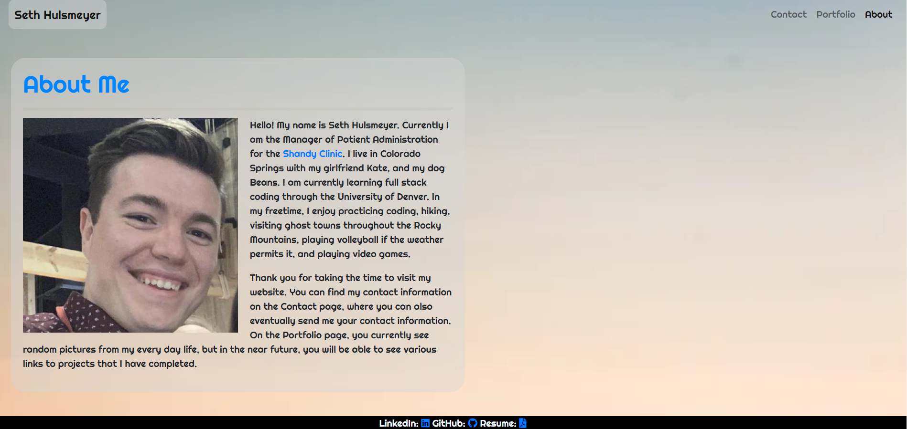
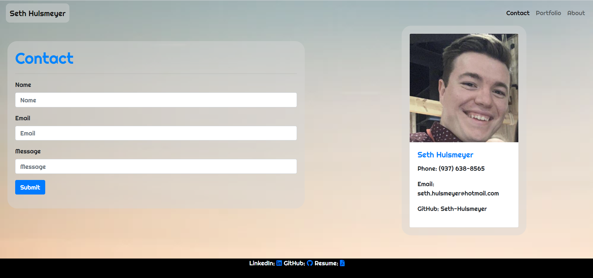
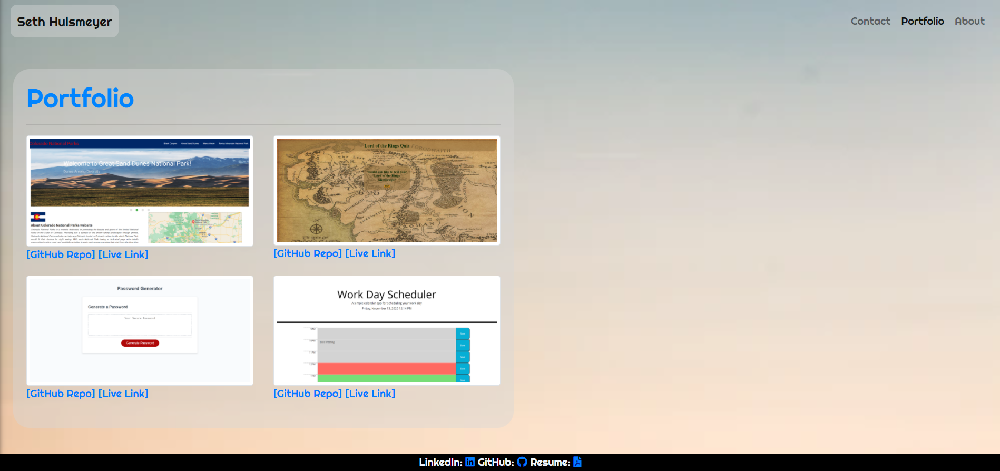
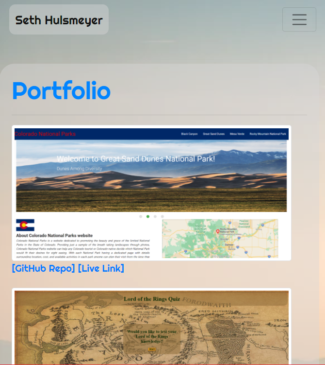

# aboutme_page

This is my coding portfolio. It will evolve as my skills in full stack coding improve.

The navbar on every page is reactive to the view portal's size.

On the About Me page (index.html) you will find personal information about me and some ideas for this portfolio.

<!--   -->

On the Contact page (contact.html) you will find a form for users to enter in their contact information, as well as some of my contact information.

<!--  -->

On the Portfolio page (portfolio.html) you will find links to the GitHub repos and live links of some applications that I have made either by myself, or part of a team.

<!--  -->

The website is responsive to the smaller screens and works on mobile devices as well.

<!--  -->

The footer now has links to my LinkedIn and GitHub profiles, as well as a link to my resume which can be downloaded

Live link: https://seth-hulsmeyer.github.io/aboutme_page/
